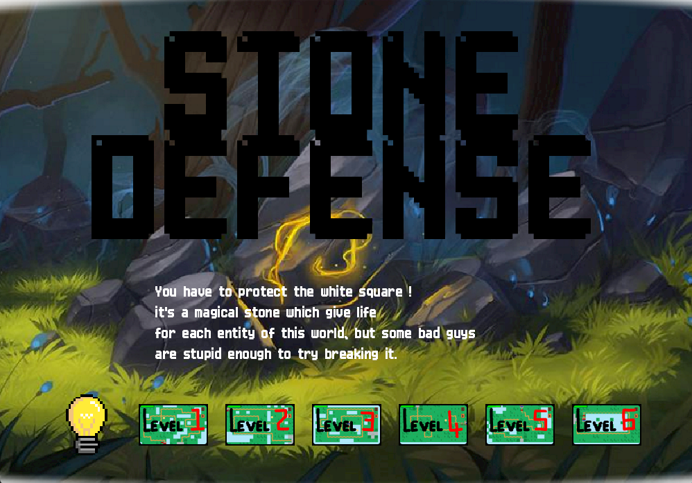
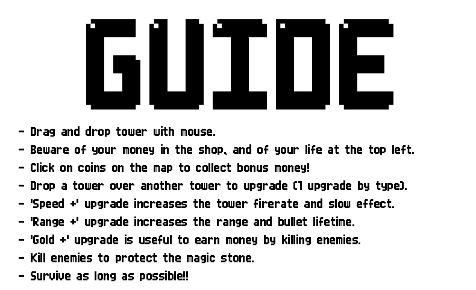
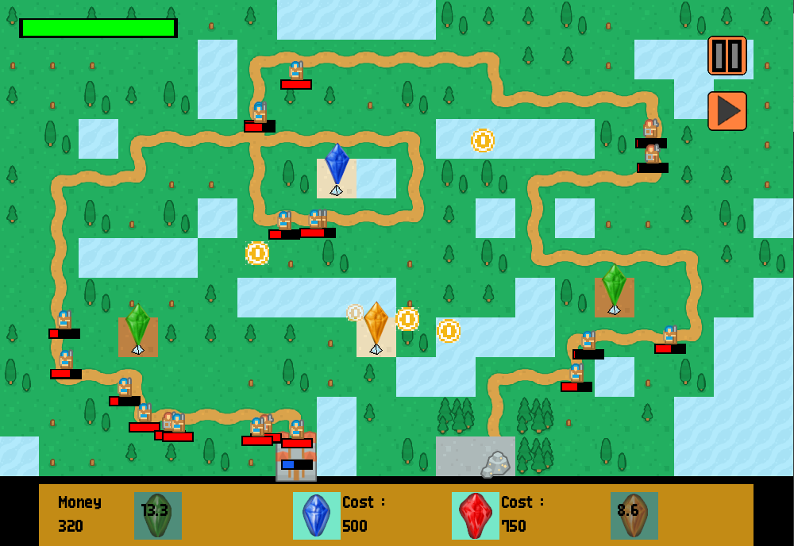
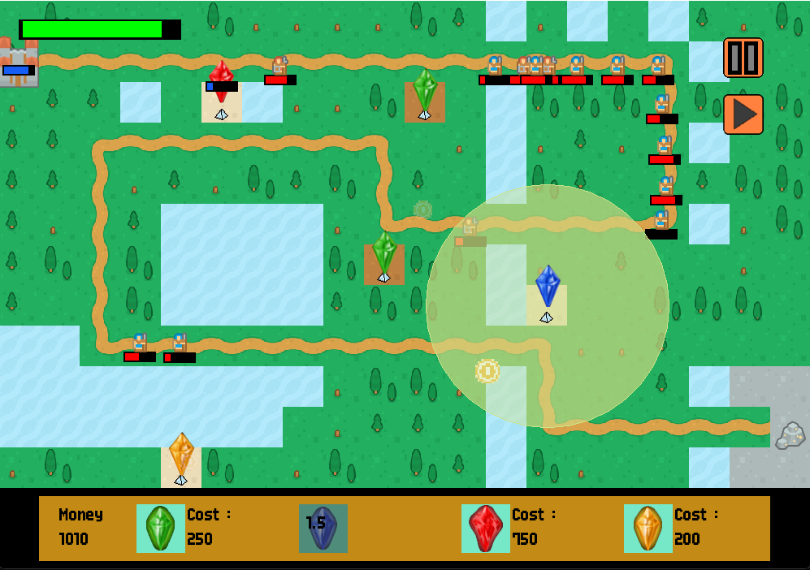
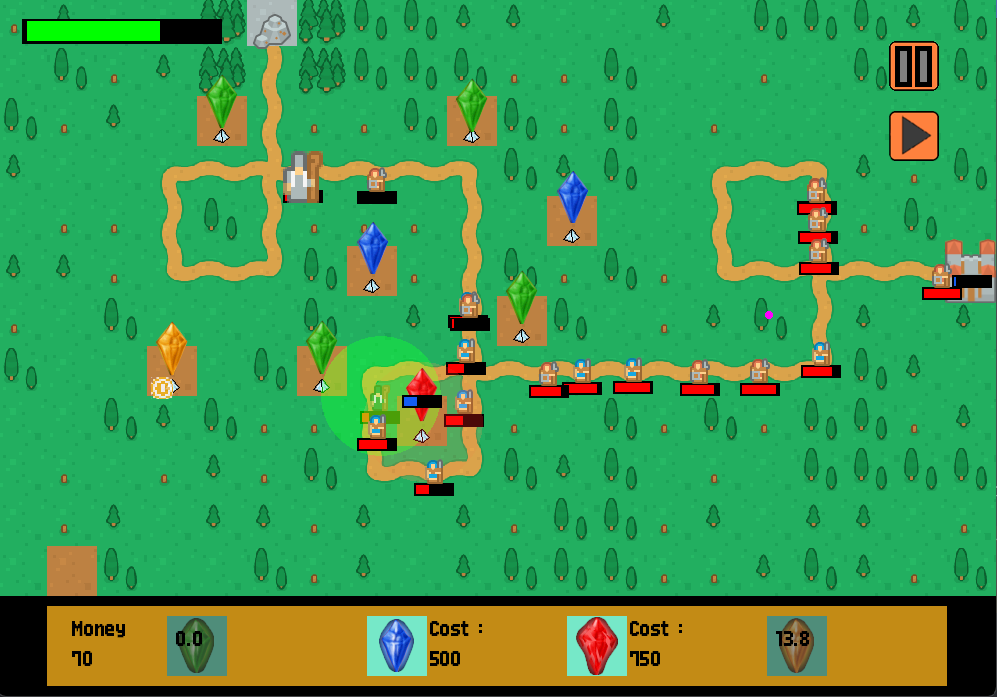
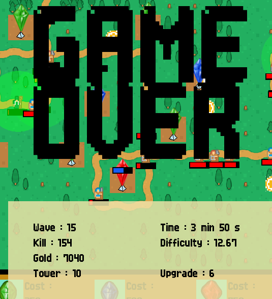

# STONE DEFENSE

*`In a medieval and magical world where a simple stone, hided in the woods, is the essence of all lives of this world, you are the prophet who will erects powerful cristal towers to eliminate those who wants to destroy the life stone.`*

`Stone Defense` is a classic **endless tower defense** game, coded in **C++** with a student rendering library. The most valuable features of `Stone Defense` is the strategic interaction you can have with your cristal towers. Indeed you can upgrade cristal towers according three capacities : **Firerate**, **Range** and **Strenght** (and even more!).  

_Will you build a lot of tower to defend all along enemies path ? Or will you upgrade some towers to build a strong line of defense ? __Choice is yours !___  

----
## Overview  

   
_The main menu is where you can choose over 6 differents levels._  
   

  
_This menu explains some features to the player. Be sure to read it first before playing!_  
    

---
  

---
  

---
  
_differents gameplay overviews_  
   

---
  
_Drag and drop a tower over another to upgrade a capcity!_  
   

---
  
_At the end of your game, you can see different statistics. Make your own record in whatever you want._

